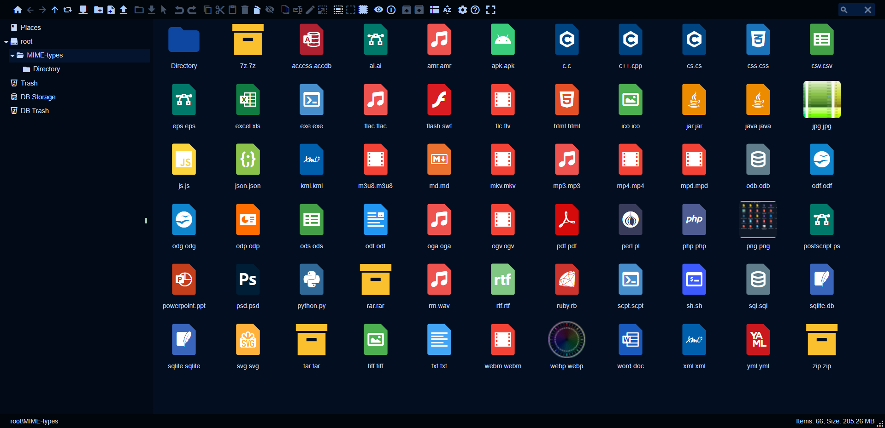

# elFinder-Material-Theme

A theme for the elFinder web file manager inspired by Google Material design.


<table>
  <tr>
    <td></td>
    <td></td>
    <td></td>
  </tr>
</table>

## Installation

Simply paste this code into the elFinder client options

```javascript
themes : {
    'mt-darkblue' : 'https://robinn1.github.io/elFinder-Material-Theme/manifests/darkblue.json', 
    'mt-gray'     : 'https://robinn1.github.io/elFinder-Material-Theme/manifests/gray.json', 
    'mt-light'    : 'https://robinn1.github.io/elFinder-Material-Theme/manifests/light.json',
},
theme : 'mt-darkblue',
```

Read more details in the [installation guide](https://github.com/Studio-42/elFinder/wiki/How-to-load-CSS-with-RequireJS%3F).
