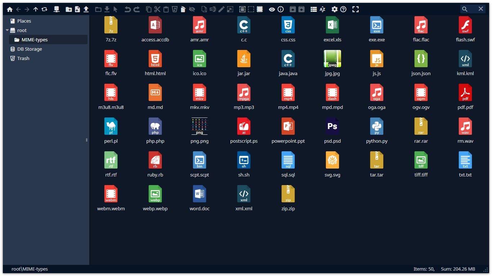
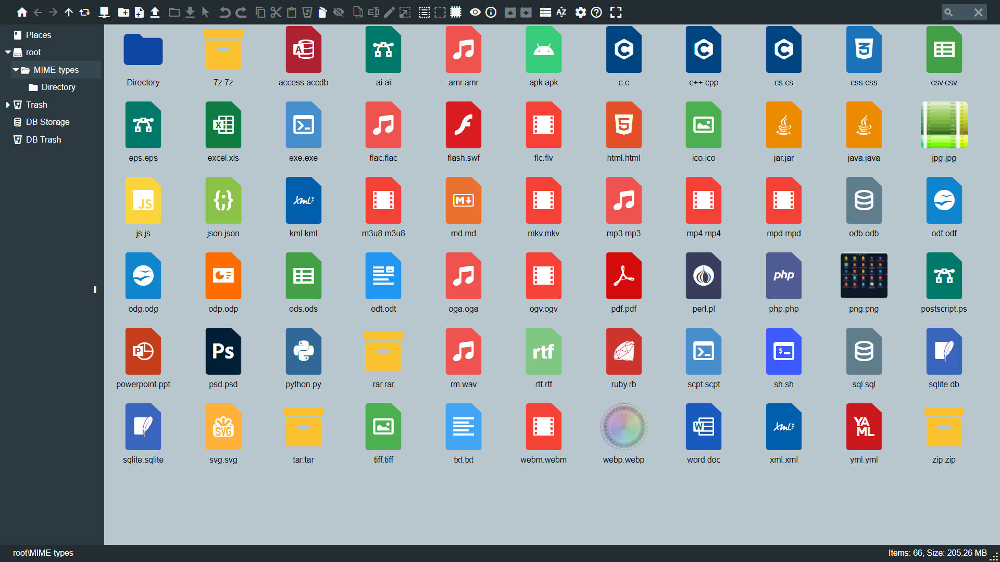
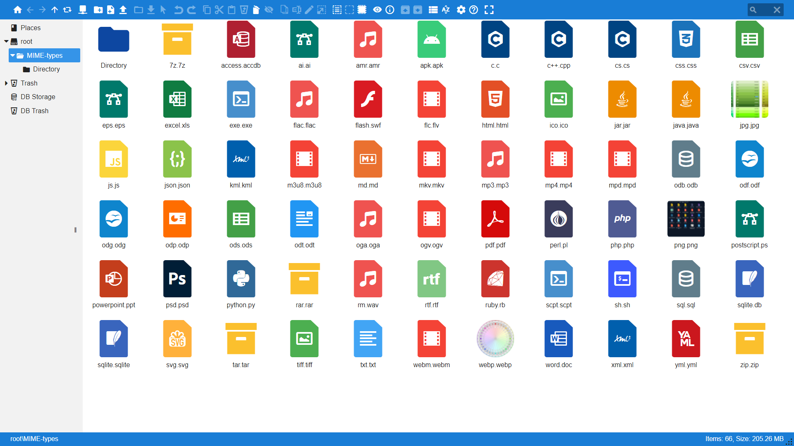

# elFinder-Material-Theme
Theme for elFinder


| Default | Gray | Light |
|:---:|:---:|:---:|
|  |  |  |

### Install guide: https://github.com/Studio-42/elFinder/wiki/How-to-load-CSS-with-RequireJS%3F

Clone the repo: ```$ git clone https://github.com/RobiNN1/elFinder-Material-Theme.git```

Install with [npm](https://www.npmjs.com): ```$ npm install elfinder-material-theme```
