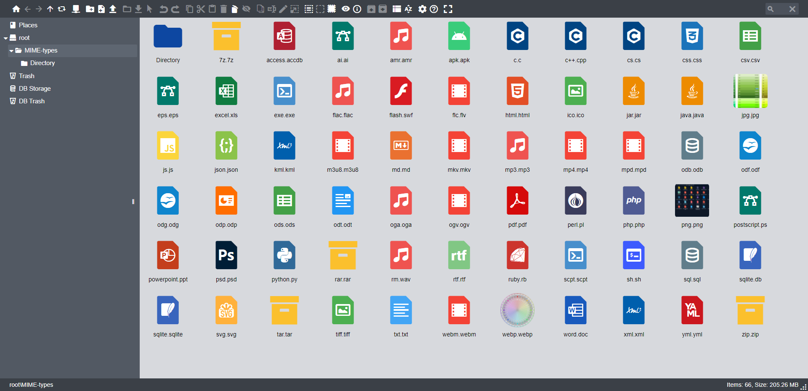

# Material Theme for elFinder

Theme for elFinder. [Install guide](https://github.com/Studio-42/elFinder/wiki/How-to-load-CSS-with-RequireJS%3F)

| Default                                     | Gray                                  | Light                                   |
|---------------------------------------------|---------------------------------------|-----------------------------------------|
|  |  |  |
