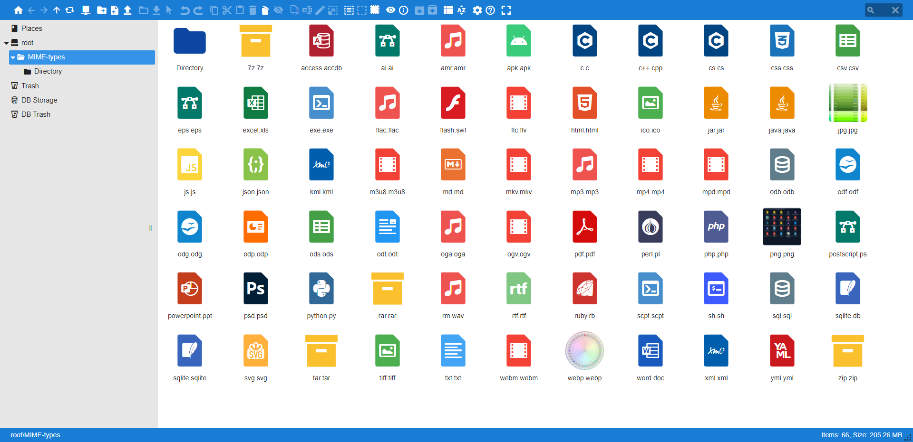

# elFinder-Material-Theme

A theme for the elFinder web file manager inspired by Google Material design.

[Install guide](https://github.com/Studio-42/elFinder/wiki/How-to-load-CSS-with-RequireJS%3F)

<table>
  <tr>
    <td></td>
    <td></td>
    <td></td>
  </tr>
</table>
